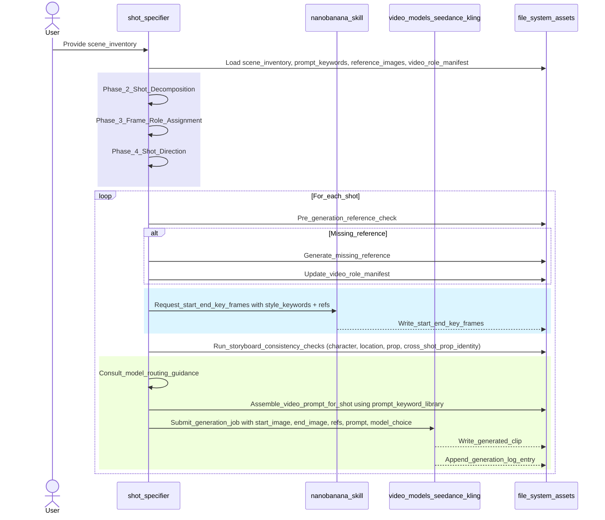
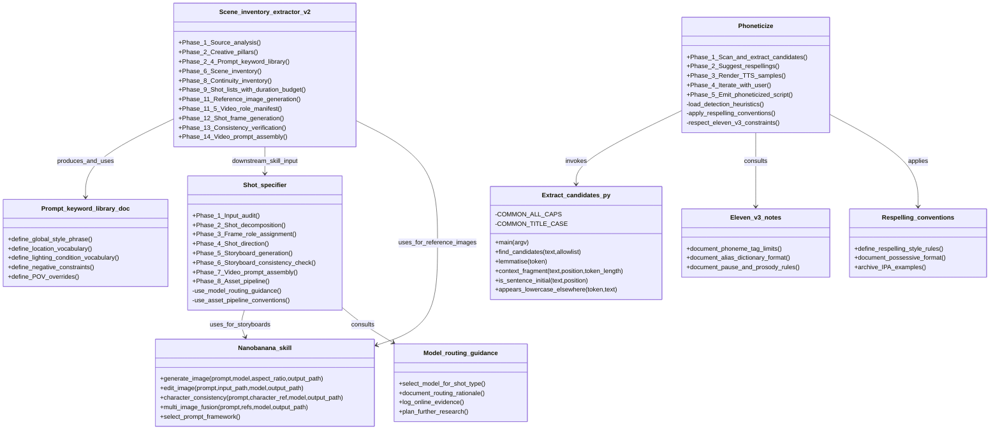
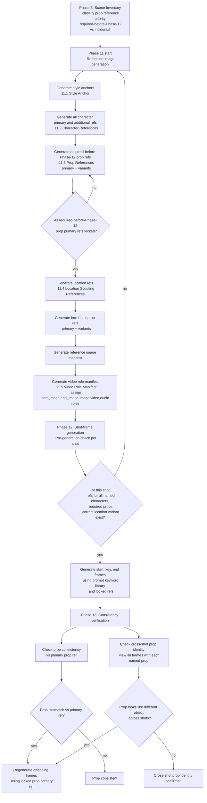

# Users' guide

This guide describes the architecture and workflows of the
visual-storytelling-skills toolkit. It covers the shot-specifier
execution sequence, the relationships between all skills and their
supporting components, and the reference-image generation pipeline
inside the scene-inventory-extractor-v2.

______________________________________________________________________

## Shot-specifier workflow

The sequence diagram below traces a single run of the `shot-specifier`
skill. The skill loads all prerequisite assets from the file system,
works through shot decomposition, frame-role assignment, and directorial
direction, then enters a per-shot loop. Inside the loop it checks for
missing references (generating and cataloguing any that are absent),
generates storyboard frames via `nanobanana`, runs consistency checks,
assembles the video prompt, and submits the generation job to the chosen
video model. The generation log is updated after every clip.

The purple band covers the three preparatory phases; the blue band
covers storyboard generation; the green band covers model routing,
prompt assembly, and video submission.

*Figure 1 — Shot-specifier execution sequence. The skill processes one
shot at a time. Missing references are resolved before storyboard frames
are generated. Video generation does not begin until consistency checks
pass.*

______________________________________________________________________

## Skill architecture

The class diagram below shows every skill, script, and reference
document in the toolkit and the relationships between them.
`scene-inventory-extractor-v2` is the upstream skill: it produces the
prompt keyword library and scene inventory that feed `shot-specifier`,
and uses `nanobanana` to generate all reference images.
`shot-specifier` consults `model-routing-guidance` to select a video
model and uses `nanobanana` for storyboard keyframes. `phoneticize`
invokes `extract_candidates.py` for regex-based candidate detection,
consults `eleven-v3-notes` for engine constraints, and applies
`respelling-conventions` throughout. `nanobanana` is a shared
image-generation layer used by both extractor and specifier; it has no
dependency on `phoneticize`.

All nanobanana image calls in this pipeline must request
`model: gemini-3-pro-image-preview`. If that model is unavailable or cannot accept the
reference images or character-consistency images required by the current operation, the
image-generation workflow stops instead of selecting a fallback model.

*Figure 2 — Skill and component relationships. Arrows show dependency
direction: an arrow from A to B means A depends on or produces input for
B. `nanobanana` is a shared image-generation layer; it does not depend
on any other skill. `phoneticize` is independent of the
image-generation pipeline.*

______________________________________________________________________

## Reference image generation pipeline

The flowchart below shows Phase 11 of `scene-inventory-extractor-v2` in
detail, together with the consistency verification loop that follows in
Phases 12 and 13. Prop references are classified in Phase 6 as either
required-before-Phase-12 (props that appear in video frames and must be
locked before any shot-frame generation begins) or incidental (props
that can be generated after location references without blocking shot
generation). The flowchart enforces that all required-before-Phase-12
prop primaries are locked before location references are generated.
Phase 12 performs a per-shot reference check; if anything is missing,
control returns to Phase 11. Phase 13 checks both individual prop
consistency against the primary reference and cross-shot prop identity
across all frames.

*Figure 3 — Reference image generation and consistency verification
pipeline (Phases 6, 11, 12, and 13 of `scene-inventory-extractor-v2`).
Required-before-Phase-12 props must be fully locked before location
reference generation begins. Phase 12 loops back to Phase 11 if any
reference is missing. Phase 13 enforces both per-shot prop consistency
and cross-shot prop identity.*
