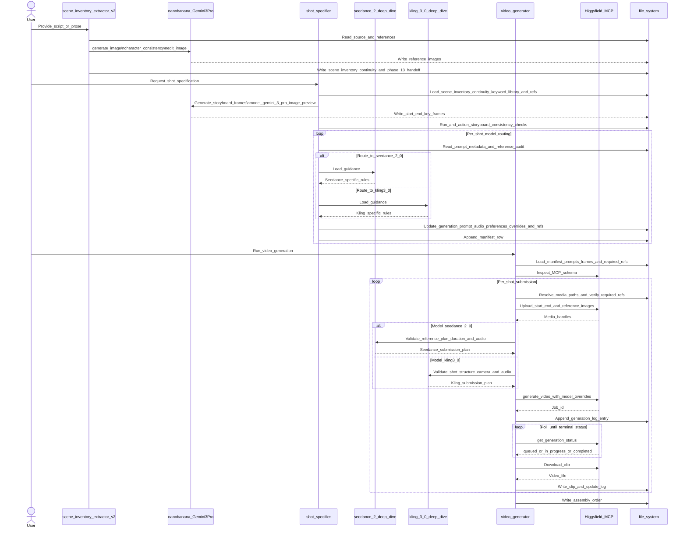
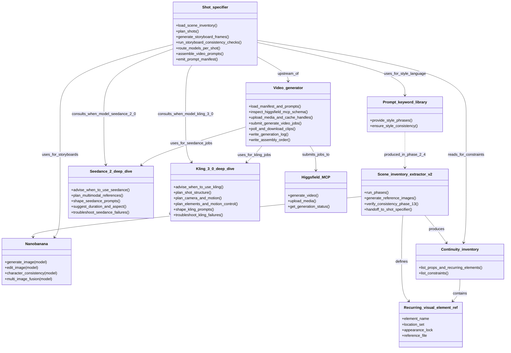
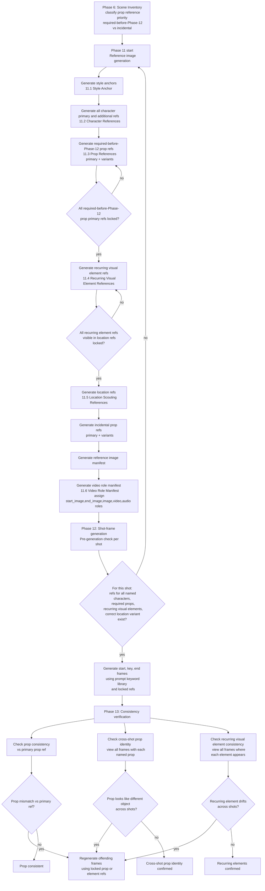

# Users' guide

This guide describes the architecture and workflows of the
visual-storytelling-skills toolkit. It covers the shot-specifier
execution sequence, the relationships between all skills and their
supporting components, and the reference-image generation pipeline
inside the scene-inventory-extractor-v2.

______________________________________________________________________

## End-to-end video production sequence

The sequence diagram below traces the whole video-production chain. The
`scene-inventory-extractor-v2` skill prepares source analysis,
reference images, the prompt keyword library, continuity inventory,
recurring visual element references, shot-frame assets, and its Phase 13
handoff. It does not assemble final video prompts or call Higgsfield.

`shot-specifier` then loads that scene pack, generates storyboard
frames through `nanobanana`, runs and actions storyboard consistency
checks, consults the model-specific deep-dive skills during per-shot
routing, and writes prompt files plus `prompts/manifest.md`.
`video-generator` owns the operational run from manifest to local clips:
it inspects the Higgsfield MCP schema, resolves and uploads media,
applies model overrides and explicit audio preferences, submits jobs,
polls status, downloads clips, updates the generation log, and writes
assembly order.

*Figure 1 — End-to-end production sequence. The extractor stops after
Phase 13 and hands a checked scene pack to `shot-specifier`.
`shot-specifier` actions consistency findings before it writes prompt
files and the manifest. `video-generator` is the only skill that calls
Higgsfield video generation, and it must verify required references,
audio preferences, model overrides, and resumable job logging before a
shot is considered complete.*

______________________________________________________________________

## Video skill architecture

The class diagram below shows the video-production portion of the
toolkit and the relationships between the skills and supporting
artefacts. `scene-inventory-extractor-v2` produces the scene pack,
continuity inventory, prompt keyword library, recurring visual element
definitions, and reference images. `shot-specifier` consumes that
package, uses `nanobanana` for storyboard frames, consults the Seedance
or Kling deep-dive skill when a shot is routed to that model, and emits
prompt files plus the manifest. `video-generator` consumes that handoff
and submits jobs through the Higgsfield MCP. The `phoneticize` skill is
part of the repository but is independent of this visual generation
pipeline.

All nanobanana image calls in this pipeline must request
`model: gemini-3-pro-image-preview`. If that model is unavailable or cannot accept the
reference images or character-consistency images required by the current operation, the
image-generation workflow stops instead of selecting a fallback model.

*Figure 2 — Video skill and artefact relationships. Solid arrows show
runtime dependency or handoff direction: the extractor creates
continuity and recurring-element constraints, `shot-specifier` turns
them into per-shot prompt and reference requirements, and
`video-generator` submits only after validating those requirements
against the live Higgsfield MCP. The dashed arrow records provenance:
the prompt keyword library is produced by extractor Phase 2.4 and then
reused downstream for style consistency.*

______________________________________________________________________

## Reference image generation pipeline

The flowchart below shows Phase 11 of `scene-inventory-extractor-v2` in
detail, together with the consistency verification loop that follows in
Phases 12 and 13. Prop references are classified in Phase 6 as either
required-before-Phase-12 (props that appear in video frames and must be
locked before any shot-frame generation begins) or incidental (props
that can be generated after location references without blocking shot
generation). Phase 6 also identifies recurring visual elements: objects,
fixtures, interfaces, machinery, furniture layouts, or set dressing that
appear in more than two shots and would be noticed if changed. The
flowchart enforces that all required-before-Phase-12 prop primaries and
recurring visual element refs are locked before location references are
generated.
Phase 12 performs a per-shot reference check; if anything is missing,
control returns to Phase 11. Phase 13 checks both individual prop
consistency against the primary reference and cross-shot prop identity
across all frames, plus recurring visual element consistency across
every shot where each element is visible. Phase 13 findings are action
items for the agent, not informational notes.

*Figure 3 — Reference image generation and consistency verification
pipeline (Phases 6, 11, 12, and 13 of `scene-inventory-extractor-v2`).
Required-before-Phase-12 props and recurring visual elements must be
fully locked before location reference generation begins when they are
visible in those locations. Phase 12 loops back to Phase 11 if any
reference is missing. Phase 13 enforces per-shot prop consistency,
cross-shot prop identity, and recurring visual element stability; the
agent must fix or explicitly route every finding before handoff.*
